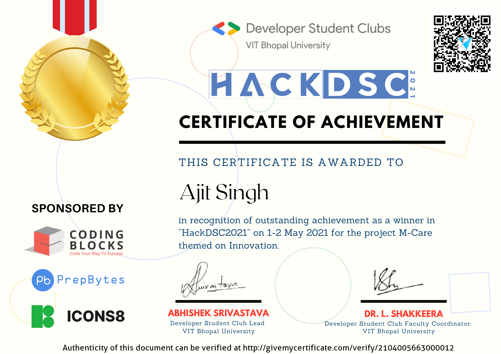

# MCARE
## Medicines And Covid related Resources for Everyone => Team CurbYourK-Means
CurbYourK-Means (IIIT Guwahati) Team Project => A part of the project (Covid 19 dashboard) was the winning (1st place) submission at HackDSC 2021, VIT. 

Idea => We accumulated the ideas for the project over the course of participating in many hackathons.
* Participating and winning *2nd position in SocioThon 2021* convinced us to work in the **healthcare** domain. The Covid-19 Pandemic uprise in India (March 2021- May 2021) convinced us to build a **Covid based application**.
* As a result, we created a healthcare application which has Covid-19 dashboard to help the poor and uninformed procure critical Covid-19 related information.  
* We also have a community help forum where users can ask for help as well as help those in need
* We are using Indian Government's JAS (PMBJP) scheme to find out the lowest cost alternative for any given medicine.
* We are using the **YouTube Data API** to help display relevant information about an entered prescription so that the user can gain some medicinal awareness.
* View our entire problem statement to know about the solutions offered by Mcare and its features:
https://drive.google.com/file/d/10eKTkN2TBWRCbOTO99PBHmGueT_YKnQG/view?usp=sharing
* Mobile (android) application for MCare: https://drive.google.com/drive/folders/1NiryGs0IJHNenSf8J8R_W_t17cYVQfQq 
* Recognition of Covid-19 dashboard at HackDSC'21 by Google Developer Students Club VIT:

